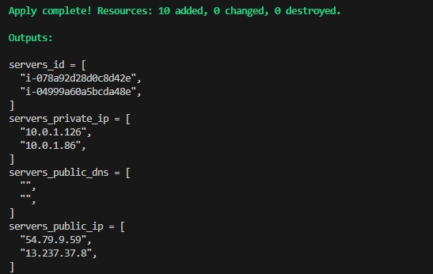
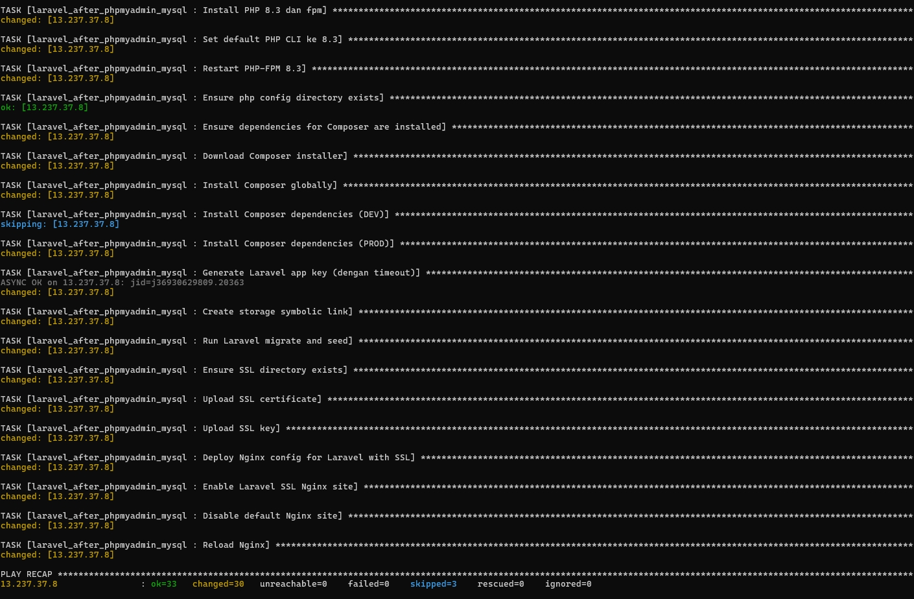
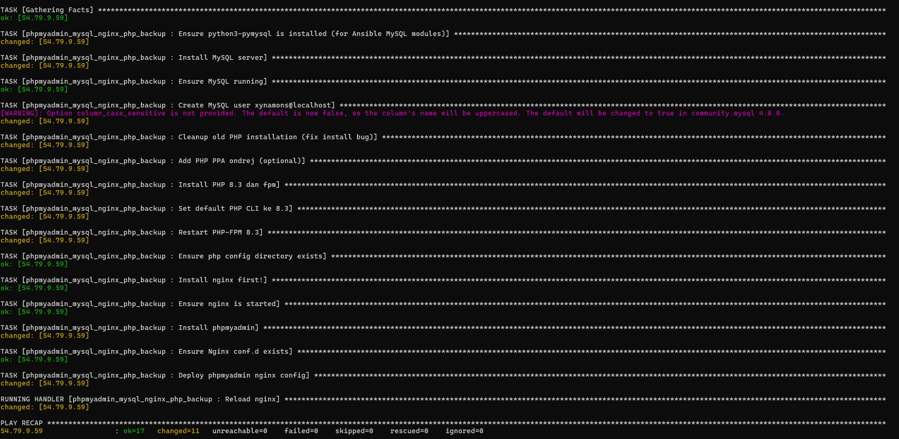

<!-- @format -->

# 🚀 Laravel + MySQL Infrastructure on AWS (Terraform + Ansible)

[](https://www.terraform.io/)
[](https://www.ansible.com/)
[](https://aws.amazon.com/)
[](https://ubuntu.com/)

# 🚀 Laravel + MySQL Infrastructure on AWS (Terraform + Ansible)

This project provisions and configures a **secure, production-ready Laravel + MySQL infrastructure on AWS**, using **Terraform** for provisioning and **Ansible** for configuration management. It also includes **phpMyAdmin**, served via **Nginx**, all deployed in **public subnets** across EC2 instances.

---

## 📌 Project Goals

- Automate full stack setup for Laravel apps
- Expose Laravel + phpMyAdmin securely via Nginx
- Allow MySQL access from Laravel via internal IP binding
- Ensure modular and reproducible DevOps pipeline

---

## 📐 Architecture Overview

AWS VPC (10.0.0.0/16)
├── Public Subnet (10.0.1.0/24) │
├── EC2-1 (Laravel + Nginx) │
└── EC2-2 (MySQL + phpMyAdmin)
└── Internet Gateway

### 🔐 Security Group Rules

| Component | Ports   | Access Source        |
| --------- | ------- | -------------------- |
| Nginx     | 80, 443 | 0.0.0.0/0 (Internet) |
| SSH       | 22      | 0.0.0.0/0 (dev only) |
| MySQL     | 3306    | Laravel IP only      |

---

## ⚙️ Tools & Tech Stack

- **Terraform** (v1.2+)
- **AWS EC2, VPC, Subnets, EIP**
- **Ansible** (with community.mysql)
- **Laravel** PHP framework
- **phpMyAdmin** for DB interface
- **Nginx** as reverse proxy
- **Ubuntu EC2 AMIs**

---

## 📁 Directory Structure

├── terraform/ # AWS infra provisioning
├── ansible/
│ ├── roles/
│ │ ├── laravel/nginx
│ │ ├── phpmyadmin/
│ └── inventories/ # host variables
├── README.md

---

## 🧪 DevOps Workflow

### Terraform

- Provision VPC, subnet, Internet Gateway
- Launch EC2 instances for:
  - Laravel + Nginx
  - MySQL + phpMyAdmin
- Attach Elastic IPs to each instance

\*note setting your security group and separate them


### Ansible

- Install required PHP packages & MySQL
- Set MySQL to listen on `0.0.0.0`
- Create MySQL user with IP-bound privileges
- Setup phpMyAdmin accessible via Nginx reverse proxy
- Deploy Laravel app (via Git clone)

---




## ✅ Getting Started

### 1. Prerequisites

- AWS account with IAM access
- Terraform CLI ≥ 1.2.0
- Ansible ≥ 2.14
- SSH key pair (e.g., `main-key.pem`)

### 2. Deploy Infrastructure

```bash
cd terraform
terraform init
terraform apply -auto-approve


3. Configure with Ansible
Update inventories/production/hosts.yml with your EC2 IPs:
[laravel]
18.0.0.1 ansible_user=ubuntu

[mysql]
18.0.0.2 ansible_user=ubuntu


ansible-playbook -i inventories/production site.yml

```

📣 Use Cases
Quick setup for Laravel proof-of-concept in the cloud

Educational template for infrastructure automation

Baseline architecture for scalable Laravel apps

🧠 Credits & Author
Created by [XrerXrerX], a DevOps & Backend Engineer passionate about infrastructure automation and scalable cloud architectures.

---
